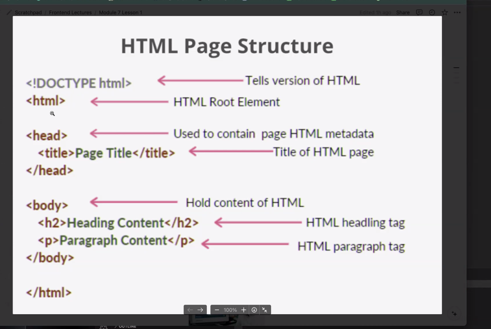
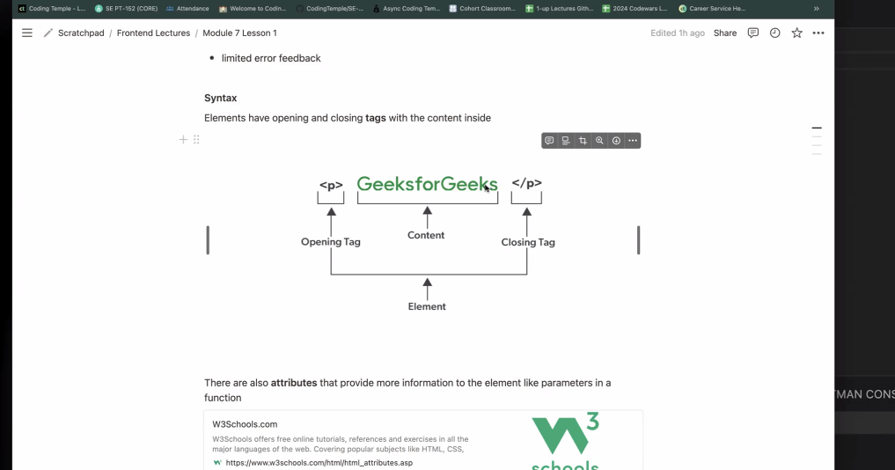

# HTML  CSS,  CSS Bootstrap 

## Markup language - all converts to html

### HTML 5 newest version
- 2010's was made friendlier and better
- easy to learn, supported by all browsers 
- mistakes are easier to get by with but harder to find 
- not overly complex- not dynamic - need frameworks for that - HTML is plain Jane 
  

## Tags and Elements 
- Tags are like this 
 
 = paragraph tag to write plain text to webpage
- 
- tags can take in a lot of info 
- example 

###  Click Go Live to see the page 
- change the ending.html to name of your doc to see the results live

# Tags
  

    break   not required 
  <em> </em> Italics 
In HTML, the 
 tag stands for "horizontal rule" and is used to create a horizontal line across a web page to visually separate content. It's often used to divide sections or mark the end of a paragraph. For example, you might insert 
 between two paragraphs to separate them. 

Windows key plus period opens the Emojis 

Command / to make notes 